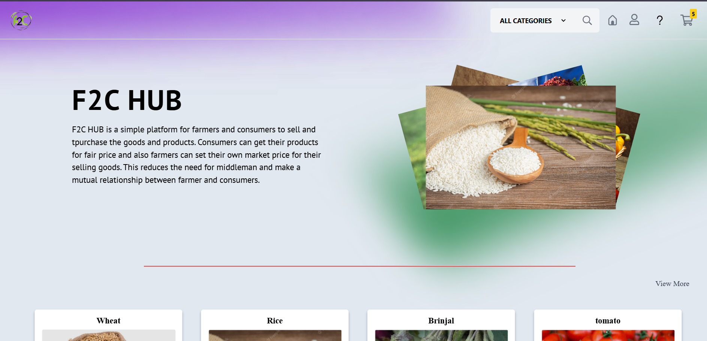

## T014 - TECH XAVIERS

---

## Problem Statement

Problem Statement ID – PY009

LOCAL MARKETPLACE FOR FARMERS

The Local Marketplace for Farmers is a mobile or web-based platform designed to connect local farmers directly with consumers, providing a marketplace to buy and sell fresh, locally grown produce without the need for middlemen. This platform empowers farmers by giving them a direct channel to reach their customers and offer fair prices while allowing consumers to access fresh and affordable produce directly from the source. The platform includes features for price comparison, real-time updates on availability, delivery options, and customer reviews, making it easy for both parties to engage in a smooth and transparent transaction.

---

## Overview

Our web platform bridges the gap between farmers and consumers, ensuring fair trade, better profits, and fresh produce. By eliminating middlemen, we empower farmers with direct sales, transparent pricing, and efficient logistics, while consumers benefit from affordable, high-quality produce.

---

## Team Members

Team ID – T014

List your team members along with their roles.

- ANISH KARTHIC V S - Team Leader
- ANAND P - FRONT END
- ARUNAW RISHE - FRONTEND
- JAISURYAN S - BACKEND
- DHARSHINI S - FRONTEND
- MUZHUMATHI V - DATABASE MANAGER AND TESTER

---

## Technical Stack

List the technologies and tools used in the project. For example:

- Frontend: HTML, CSS, JavaScript, ReactJS
- Backend:  Django
- Database: Postgresql
- Other Tools: Git, github

---

## Getting Started

Follow these steps to clone and run the application locally.

### Prerequisites

1. Install [Python](https://www.python.org/downloads/).
2. Install [Git](https://git-scm.com/).
3. Clone this repository:
   bash
   git clone https://github.com/PYEXPO25/T014_TECHXAVIERS
   

### Installation

1. Navigate to the project directory:
   bash
   cd repository-name
   
2. Create a virtual environment:
   bash
   python -m venv venv
   
3. Activate the virtual environment:
   - On Windows:
     bash
     venv\Scripts\activate
     
   - On macOS/Linux:
     bash
     source venv/bin/activate
     
4. Install dependencies:
   bash
   pip install -r requirements.txt
   
5. Navigate to source
   bash
   cd source
   

---

## Start the Application

1. Run the Django application:
   bash
   python manage.py runserver
   
2. Open your browser and navigate to:
   
   http://127.0.0.1:8000/
   

---

## UI Overview

Images to demonstrate the user interface:

Example pages:

1. Landing Page:
   

2. Dashboard:
   

3. LOGIN PAGE:
   

---

## Resources

### 📄 PowerPoint Presentation
[Click here to view the PPT](resource/T014_TECH_XAVIERS.pptx)
### 🎥 Project Video
[Click here to view the project demo video](insert-drive-link-here)

### 📹 YouTube Link
[Watch the project on YouTube](insert-youtube-link-here)

---
